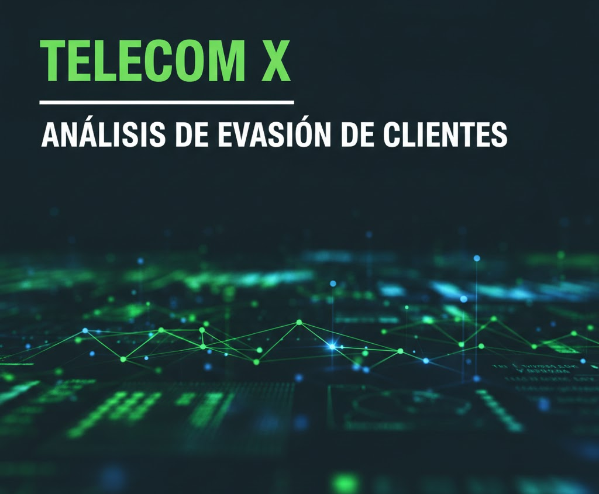
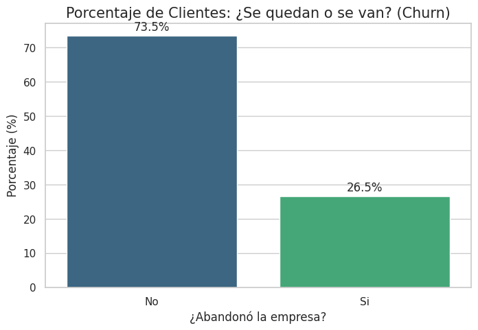
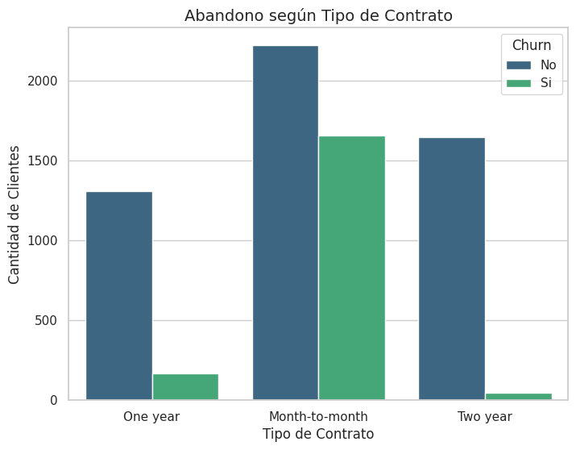
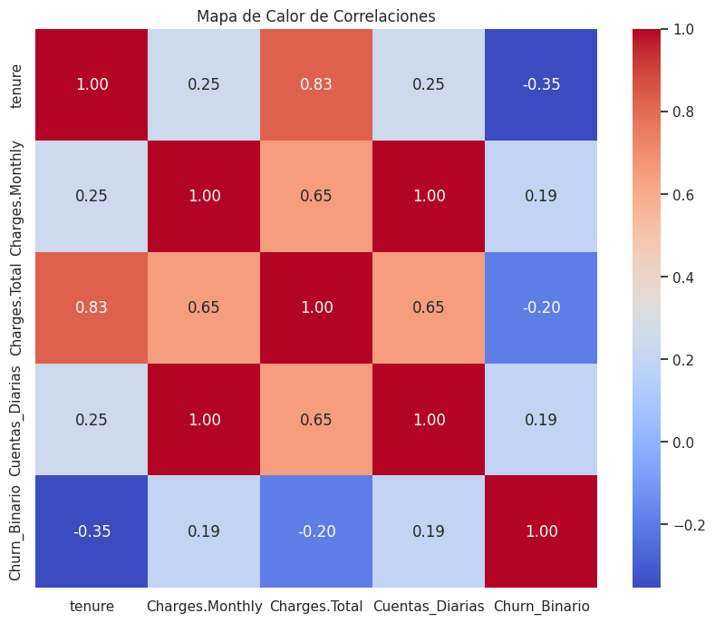

# 📊 Análisis de Evasión de Clientes - Telecom X

Este proyecto realiza un análisis exploratorio de datos (EDA) profundo sobre la evasión de clientes (*churn*) en la empresa **Telecom X**. A través de la ciencia de datos, identificamos patrones críticos y factores de riesgo para proponer estrategias de retención efectivas dentro del marco del programa **Oracle Next Education (#ONE)** de **Alura Latam**.

---
---

## 📍 Índice
1. [Objetivo del Proyecto](#-objetivo-del-proyecto)
2. [Herramientas y Tecnologías](#-herramientas-y-tecnologías)
3. [Proceso de Datos (Pipeline)](#️-proceso-de-datos-pipeline)
4. [Hallazgos Clave](#-hallazgos-clave)
5. [Conclusiones y Recomendaciones](#-conclusiones-y-recomendaciones)
6. [Autor](#-autor)

  
## 🚀 Objetivo del Proyecto

Telecom X busca reducir su tasa de cancelación. Este análisis se enfoca en:
* **Normalizar** datos complejos provenientes de estructuras JSON.
* **Identificar** perfiles de clientes con alta probabilidad de abandono.
* **Cuantificar** el impacto financiero mediante nuevas métricas como `Cuentas_Diarias`.
* **Visualizar** relaciones clave entre el tipo de contrato, cargos mensuales y la permanencia del cliente.

## 🧰 Herramientas y Tecnologías

* **Python 3**
* **Pandas** – Limpieza y normalización de datos.
* **NumPy** – Procesamiento numérico.
* **Seaborn & Matplotlib** – Visualización estadística avanzada.
* **Google Colab** – Entorno de desarrollo en la nube.

## 🛠️ Proceso de Datos (Pipeline)

A diferencia de análisis convencionales, este proyecto puso especial énfasis en la calidad de la información:
1. **Extracción y Normalización:** Desglose de 4 columnas JSON en 22 variables independientes.
2. **Limpieza Rigurosa:** Identificación y eliminación de **224 registros nulos** en la variable objetivo.
3. **Corrección de Tipos:** Transformación de datos financieros de texto a numérico (`Charges.Total`).
4. **Ingeniería de Variables:** Creación de la métrica `Cuentas_Diarias` para análisis granular de facturación.

## 📈 Hallazgos Clave

A través del análisis visual y estadístico, identificamos los siguientes puntos críticos:

### 1. Magnitud de la Evasión

* **Tasa de Churn Real:** Tras la limpieza y curaduría de datos, se determinó una evasión del **26.5%**. Este valor representa el punto de partida para las estrategias de retención.

### 2. Segmentación por Contrato y Pago

* **Factor Contractual:** Los clientes con contratos **mes a mes** son el principal detonante de fuga.
* **Método de Pago:** Se detectó una correlación alta de abandono en usuarios que utilizan *Electronic Check*.

### 3. Comportamiento y Lealtad (Tenure)

* **Punto de Lealtad:** La probabilidad de abandono disminuye drásticamente después de los **12 meses** de antigüedad (*tenure*). Los primeros meses son el periodo de mayor riesgo.

### 4. Análisis de Costos y Correlación

* **Impacto de Costos:** Los clientes que cancelan pagan, en promedio, cargos mensuales superiores a los que permanecen, lo que sugiere una sensibilidad al precio.
* **Correlación:** El análisis matemático confirma que la **antigüedad** y los **cargos mensuales** son los principales predictores del comportamiento del cliente.

## 📝 Conclusiones y Recomendaciones

* **Fidelización Temprana:** Implementar campañas de bienvenida y seguimiento proactivo durante los primeros 6 meses.
* **Migración de Contratos:** Ofrecer incentivos para que los clientes pasen de contratos mensuales a anuales.
* **Anclaje de Servicios:** Promover servicios como *Tech Support* y *Online Security*, que aumentan la permanencia.

## 🧑‍💻 Autor

### **Made by:Ivana Papaño**

*Aspirante a Analista de Datos | Alumno en el programa ONE (Oracle + Alura Latam)*

 
 

---
---

